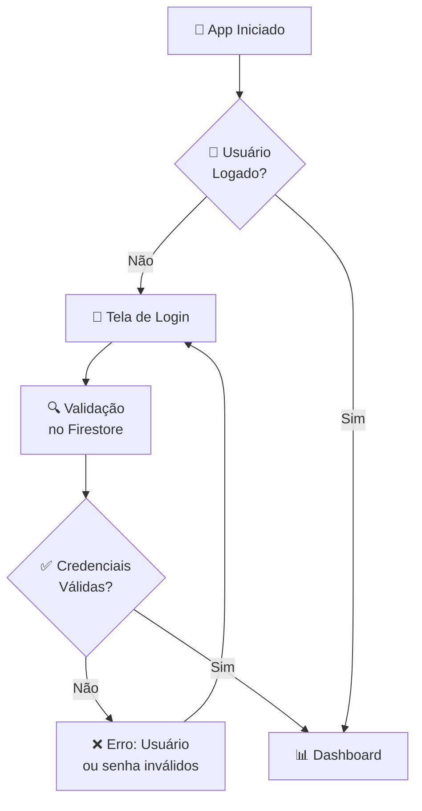
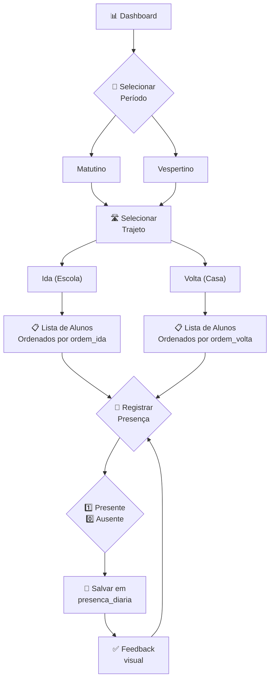
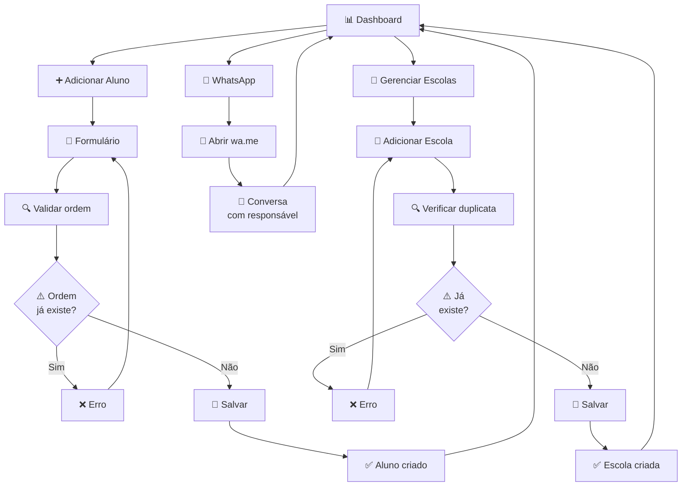
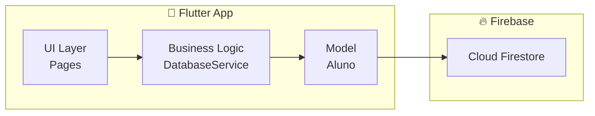
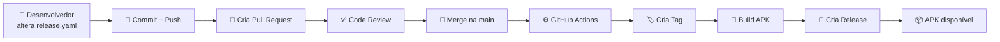

# Projeto Extensionista (PEX) - Tia Lara 🚌

<div align="center">


</div>

---

## 📋 Índice

1. [Sobre o Projeto](#sobre-o-projeto)
2. [Tecnologias Utilizadas](#tecnologias-utilizadas)
3. [Estrutura do Projeto](#estrutura-do-projeto)
4. [Arquitetura do Banco de Dados](#arquitetura-do-banco-de-dados)
5. [Fluxo da Aplicação](#fluxo-da-aplicação)
6. [GitHub Actions (CI/CD)](#github-actions-cicd)
7. [Como Executar](#como-executar)
8. [Convenções de Código](#convenções-de-código)
9. [Release e Versionamento](#release-e-versionamento)
10. [Contribuição](#contribuição)

---

## 📱 Sobre o Projeto

Este projeto é um **Projeto Extensionista (PEX)** desenvolvido para a **Católica de Santa Catarina** com o objetivo de criar uma aplicação mobile para a **Transportadora Tia Lara**.

O foco principal é oferecer uma ferramenta de gerenciamento de transporte escolar que melhore a segurança e a organização durante os deslocamentos dos estudantes.

### Funcionalidades Principais

| Funcionalidade | Descrição |
|----------------|-----------|
| 📝 **Cadastro de Alunos** | Registro completo de alunos com dados do responsável |
| 🚌 **Controle de Embarque** | Registro em tempo real do embarque e desembarque |
| 🏫 **Gestão de Escolas** | Cadastro e gerenciamento de escolas parceiras |
| 📊 **Dashboard** | Visualização em tempo real dos alunos e rotas |
| 📱 **WhatsApp Integration** | Comunicação direta com responsáveis via WhatsApp |
| 🔐 **Autenticação** | Login seguro para transportadores |

---

## 🛠 Tecnologias Utilizadas

### Frameworks e Linguagens

```yaml
Flutter: 3.41.6
Dart: 3.11.1
```

### Dependências Principais

| Pacote | Versão | Descrição |
|--------|--------|-----------|
| `firebase_core` | ^2.30.0 | Inicialização do Firebase |
| `cloud_firestore` | ^4.15.8 | Banco de dados NoSQL |
| `firebase_auth` | ^4.17.8 | Autenticação Firebase |
| `url_launcher` | ^6.1.0 | Abrir URLs (WhatsApp) |
| `shared_preferences` | ^2.2.2 | Armazenamento local |

### Serviços

- 🔥 **Firebase** - Backend como serviço
- ☁️ **Cloud Firestore** - Banco de dados em tempo real
- 🔐 **Firebase Auth** - Sistema de autenticação

---

## 📁 Estrutura do Projeto

```
PEX_2026/
├── lib/                          # Código fonte principal
│   ├── main.dart                 # Ponto de entrada da aplicação
│   ├── login_page.dart           # Tela de login
│   ├── dashboard_page.dart       # Dashboard principal
│   ├── add_aluno_page.dart      # Adicionar novo aluno
│   ├── edit_aluno_page.dart      # Editar aluno existente
│   ├── escolas_page.dart        # Gerenciamento de escolas
│   ├── cadastro_transportador_page.dart  # Cadastro de transportador
│   ├── database_service.dart     # Camada de acesso ao banco
│   ├── student_model.dart        # Modelo de dados do aluno
│   └── firebase_options.dart     # Configurações Firebase
│
├── .github/workflows/            # Workflows de CI/CD
│   ├── flutter_ci.yml           # Análise e testes
│   ├── create_tag.yml           # Criação de releases
│   ├── validate_version.yml     # Validação de versão
│   ├── security.yml             # Verificação de segurança
│   └── verify_pr_name.yml       # Validação de PR
│
├── android/                      # Configurações Android
├── ios/                          # Configurações iOS
├── web/                          # Configurações Web
├── test/                         # Testes unitários
├── pubspec.yaml                  # Dependências do projeto
├── release.yaml                  # Versão de release
└── README.md                     # Este arquivo
```

---

## 🗄 Arquitetura do Banco de Dados

O projeto utiliza **Cloud Firestore** (NoSQL) do Firebase. Abaixo está a estrutura das coleções e documentos:

### Coleções

#### 1. `transportadores`

Documento que representa um transportador cadastrado.

**Campos:**
| Campo | Tipo | Descrição |
|-------|------|-----------|
| `uid` | string | ID único do transportador |
| `nome` | string | Nome completo |
| `usuario` | string | Nome de usuário para login |
| `senha` | string | Senha de acesso |
| `whatsapp` | string | Número com DDI |
| `veiculo` | string | Descrição do veículo |
| `numero_escolar` | string | Número de autorização escolar |

---

#### 2. `alunos`

Documento que representa um aluno cadastrado.

**Campos:**
| Campo | Tipo | Descrição |
|-------|------|-----------|
| `nome_aluno` | string | Nome completo do aluno |
| `escola` | string | Nome da escola vinculada |
| `endereco_casa` | string | Endereço de residência |
| `periodo` | string | Turno (Matutino/Vespertino) |
| `responsavel` | string | Nome do responsável |
| `whatsapp_responsavel` | string | WhatsApp do responsável |
| `ordem_ida` | int | Ordem de embarque (ida) |
| `ordem_volta` | int | Ordem de desembarque (volta) |
| `id_transportador` | string | UID do transportador |

> **Nota:** Se `ordem_ida` for 0, o aluno não faz o trajeto de ida. Se `ordem_volta` for 0, não faz o trajeto de volta.

---

#### 3. `escolas`

Documento que representa uma escola parceira.

**Campos:**
| Campo | Tipo | Descrição |
|-------|------|-----------|
| `nome` | string | Nome da escola |
| `nome_lower` | string | Nome em minúsculas (para busca) |
| `id_transportador` | string | UID do transportador |
| `criado_em` | timestamp | Data de cadastro |

---

#### 4. `presenca_diaria`

Documento que registra a presença diária do aluno.

**ID do documento:** `{alunoId}_{trajeto}_{data}` (ex: `aluno001_ida_2024-03-15`)

**Campos:**
| Campo | Tipo | Descrição |
|-------|------|-----------|
| `id_crianca` | string | ID do aluno |
| `trajeto` | string | "ida" ou "volta" |
| `data` | timestamp | Data e hora do registro |
| `presenca` | int | Status (0=ausente, 1=presente) |

---

### Diagrama ER Simplificado

```
┌─────────────────┐       ┌─────────────────┐
│ transportadores │       │     escolas     │
├─────────────────┤       ├─────────────────┤
│ uid (PK)        │       │ id (PK)         │
│ nome            │       │ nome            │
│ usuario         │──┐    │ id_transportador │
│ senha           │  │    │                 │
│ whatsapp        │  └──►│                 │
│ veiculo         │       └─────────────────┘
└─────────────────┘

       │
       │ 1:N
       ▼

┌─────────────────┐       ┌─────────────────┐
│     alunos      │       │ presenca_diaria │
├─────────────────┤       ├─────────────────┤
│ id (PK)         │       │ id (PK)         │
│ nome_aluno      │       │ id_crianca (FK) │
│ escola          │       │ trajeto         │
│ periodo         │       │ data            │
│ responsavel     │──────►│ presenca        │
│ ordem_ida       │       └─────────────────┘
│ ordem_volta     │
│ id_transportador│
└─────────────────┘
```

---

## 🔀 Fluxo da Aplicação

O fluxo da aplicação é dividido em 3 partes principais para melhor visualização:

### 1. Fluxo de Autenticação



---

### 2. Fluxo de Seleção de Rota



---

### 3. Fluxo de Operações



---

### Fluxo de Dados (Arquitetura)

### Fluxo de Dados



---

## ⚙️ GitHub Actions (CI/CD)

O projeto possui **5 workflows** automatizados que garantem qualidade e segurança:

---

### 1. Flutter CI (`flutter_ci.yml`)

Executa análise estática e testes a cada Pull Request.

```yaml
name: Flutter CI
on:
  pull_request:
    branches: [main]
```

**O que faz:**
1. ✅ Checkout do código
2. ⚙️ Configura Flutter 3.41.6
3. 📦 Instala dependências (`flutter pub get`)
4. 🔍 Executa análise estática (`flutter analyze`)
5. 🧪 Executa testes (`flutter test`)

**Quando executa:**
- A cada PR aberto ou atualizado para `main`

**Exemplo de uso:**
```bash
# Executar localmente
flutter pub get
flutter analyze
flutter test
```

---

### 2. Create Tag + Build APK + Release (`create_tag.yml`)

Cria tags de release e gera APK automaticamente.

```yaml
name: Create Tag + Build APK + Release
on:
  push:
    branches: [main]
```

**O que faz:**
1. 📥 Checkout do código
2. 📊 Lê versão do `release.yaml`
3. 🏷️ Cria tag Git
4. ☕ Configura Java 17
5. ⚙️ Configura Flutter 3.41.6
6. 📦 Instala dependências
7. 📱 Build APK Release
8. 🚀 Cria Release no GitHub com APK

**Quando executa:**
- Após merge na branch `main`

**Exemplo de arquivo `release.yaml`:**
```yaml
version: v1.0.0
```

**Fluxo:**
```
Merge PR → Trigger Workflow → Lê versão → Cria Tag → Build APK → Cria Release
```

---

### 3. Validate Version Tag (`validate_version.yml`)

Valida se a versão informada no PR já existe no remoto.

```yaml
name: Validate Version Tag
on:
  pull_request:
    branches: [main]
```

**O que faz:**
1. 📥 Checkout do código
2. 📊 Lê versão do `release.yaml`
3. 🏷️ Busca tags no remoto
4. ✅ Valida se tag não existe

**Quando executa:**
- A cada PR aberto ou atualizado para `main`

**Exemplo de erro:**
```
❌ TAG já existe no remoto!
```

---

### 4. Security Check (`security.yml`)

Verifica dependências desatualizadas ou com vulnerabilidades.

```yaml
name: Security Check
on:
  pull_request:
    branches: [main]
```

**O que faz:**
1. 📥 Checkout do código
2. ⚙️ Configura Flutter 3.41.6
3. 🔒 Verifica dependências (`dart pub outdated`)

**Quando executa:**
- A cada PR aberto ou atualizado para `main`

**Saída esperada:**
```
Dependencies:
  cloud_firestore: 4.15.8 (wanted: 4.15.9)
  firebase_auth: 4.17.8 (wanted: 4.18.0)
```

---

### 5. PR Title Lint (`verify_pr_name.yml`)

Valida o título do Pull Request seguindo convenção de commits.

```yaml
name: PR Title Lint
on:
  pull_request:
    types: [opened, edited, reopened, synchronize]
```

**O que faz:**
1. 📝 Lê título do PR
2. ✅ Valida formato com regex

**Padrão aceito:**
```
^(✨|🐛|📝|🚀|🔧|🧪|♻️|💄|📦|✅)?\s*(FEAT|FIX|DOCS|CHORE|REFACTOR|PERF|STYLE|TEST|BUILD|CI)(\([a-z0-9_-]+\))?:\s+.+$
```

**Exemplos válidos:**
```
✨ FEAT: adicionar tela de login
🐛 FIX: corrigir crash no Android
📝 DOCS: atualizar README
🔧 CHORE: atualizar dependências
🚀 CI: adicionar novo workflow
```

**Emojis suportados:**
| Emoji | Significado |
|-------|-------------|
| ✨ | FEAT - Nova funcionalidade |
| 🐛 | FIX - Correção de bug |
| 📝 | DOCS - Documentação |
| 🚀 | CI - CI/CD |
| 🔧 | CHORE - Tarefa |
| 🧪 | TEST - Testes |
| ♻️ | REFACTOR - Refatoração |
| 💄 | STYLE - Estilo |
| 📦 | BUILD - Build |

---

### Resumo dos Workflows

| Workflow | Gatilho | Objetivo |
|----------|---------|----------|
| `flutter_ci.yml` | PR para main | Análise + Testes |
| `create_tag.yml` | Push para main | Release + APK |
| `validate_version.yml` | PR para main | Validar versão |
| `security.yml` | PR para main | Segurança |
| `verify_pr_name.yml` | PR | Padrão de título |

---

## 🚀 Como Executar

### Pré-requisitos

- Flutter SDK 3.41.6+
- Dart SDK 3.11.1+
- Node.js 18+ (para Firebase CLI)
- Conta no Firebase

### Passos

#### 1. Clone o repositório

```bash
git clone https://github.com/luizmmacedo/PEX_2026.git
cd PEX_2026
```

#### 2. Configure o Firebase

```bash
# Instale Firebase CLI se necessário
npm install -g firebase-tools

# Faça login
firebase login

# Crie o projeto no Firebase Console
# https://console.firebase.google.com/
```

#### 3. Configure as credenciais

1. Crie um projeto no [Firebase Console](https://console.firebase.google.com/)
2. Ative **Cloud Firestore** e **Authentication**
3. Baixe o arquivo `google-services.json`
4. Place em `android/app/google-services.json`

#### 4. Instale as dependências

```bash
flutter pub get
```

#### 5. Execute no emulador/dispositivo

```bash
flutter run
```

#### 6. Build para produção

```bash
# Android APK
flutter build apk --release

# iOS
flutter build ios --release

# Web
flutter build web
```

---

## 📏 Convenções de Código

### Padrão de Commits

Seguimos o padrão [Conventional Commits](https://www.conventionalcommits.org/):

```
<emoji> <TYPE>(<scope>): <description>
```

Exemplos:
```bash
git commit -m "✨ FEAT: adicionar tela de login"
git commit -m "🐛 FIX: corrigir erro de autenticação"
git commit -m "📝 DOCS: atualizar README"
```

## 🏷️ Release e Versionamento

O projeto utiliza um arquivo `release.yaml` na raiz para definir a versão de release.

### Formato da Versão

```
vX.Y.Z
```

- **X**: Versão major (mudanças incompatíveis)
- **Y**: Versão minor (novas funcionalidades compatíveis)
- **Z**: Versão patch (correções de bugs)

### Exemplo

```yaml
# release.yaml
version: v1.0.0
```

### Fluxo de Release



### Regras

1. A tag não pode existir previamente no remoto
2. O workflow `validate_version.yml` impede tags duplicadas
3. O APK é gerado automaticamente e anexado ao Release

---

## 🤝 Contribuição

### Como Contribuir

1. **Fork** o repositório
2. Crie uma **branch** para sua feature (`git checkout -b feature/nova-funcionalidade`)
3. Faça **commits** seguindo o padrão
4. Push para o repositório (`git push origin feature/nova-funcionalidade`)
5. Abra um **Pull Request**

### Checklist de PR

- [ ] Título segue o padrão Conventional Commits
- [ ] Passou na análise estática (`flutter analyze`)
- [ ] Passou nos testes (`flutter test`)
- [ ] Não há vulnerabilidades de segurança
- [ ] Documentação atualizada (se necessário)

---

## 📞 Contato

- **Desenvolvedor:** Luiz Macedo
- **Projeto:** PEX 2026

---
